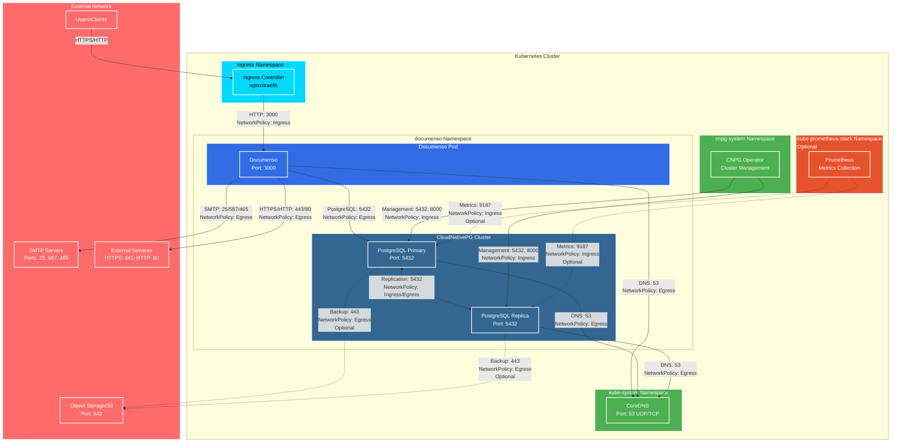

# Helm chart for Documenso

[Documenso](https://github.com/documenso/documenso) is an open-source document signing platform that provides a free alternative to DocuSign. 

## Architecture

The following diagram illustrates the documenso Helm chart architecture with network flows when NetworkPolicies are enabled:



### Network Flow Legend

- **Solid lines**: Required network flows
- **Dashed lines**: Optional network flows (configurable)
- **NetworkPolicy labels**: Indicate which NetworkPolicy rule controls the flow

### Key Components

1. **Documenso Application**
   - Receives traffic from Ingress Controller on port 3000
   - Connects to PostgreSQL database on port 5432
   - Sends emails via SMTP servers
   - Uses signing certificate for document signing
   - Optional OIDC authentication support

2. **CloudNativePG Cluster**
   - Managed by CNPG operator
   - Supports high availability with primary/replica instances
   - Replication between instances on port 5432
   - Optional backup to Object Storage (S3-compatible)

3. **Network Policies**
   - Control ingress and egress traffic for both documenso and PostgreSQL
   - Disabled by default for compatibility
   - Enable with `networkPolicy.documenso.enabled` and `networkPolicy.postgresql.enabled`

4. **Monitoring (Optional)**
   - Prometheus can scrape metrics from both documenso and PostgreSQL
   - Requires enabling monitoring in NetworkPolicy configuration

## TL;DR

```console
$ helm install my-release oci://registry-1.docker.io/captnbp/documenso
```

## Prerequisites

- Kubernetes 1.30+
- Helm 3.2.0+
- PV provisioner support in the underlying infrastructure
- [cert-manager](https://cert-manager.io/)
- [CloudNativePG Operator](https://cloudnative-pg.io/documentation/current/) (if using PostgreSQL) 1.26+

## Migration from Bitnami PostgreSQL to CloudNativePG

This chart now uses [CloudNativePG](https://cloudnative-pg.io/) instead of Bitnami PostgreSQL for PostgreSQL database support. CloudNativePG is a Kubernetes operator that provides native PostgreSQL management capabilities.

### Key Changes

1. **Operator-based management**: CNPG uses a Kubernetes operator pattern for managing PostgreSQL clusters
2. **Native Kubernetes integration**: Better integration with Kubernetes APIs and resource management
3. **Enhanced features**: Support for high availability, backups, monitoring, and more

### Migration Steps

1. **Install CloudNativePG Operator**: Before deploying this chart, ensure the CNPG operator is installed in your cluster:

```bash
kubectl apply -f https://raw.githubusercontent.com/cloudnative-pg/cloudnative-pg/release-1.28/releases/cnpg-1.28.0.yaml
```

2. **Update your values**: The PostgreSQL configuration has changed. Update your `values.yaml`:

```yaml
postgresql:
  enabled: true
  instances: 1
  storage:
    size: 10Gi
  auth:
    username: documenso
    database: documenso
```

3. **Backup your data**: If migrating from an existing Bitnami PostgreSQL installation, ensure you have a backup of your database.

4. **Deploy**: Deploy the chart as usual. The CNPG operator will automatically create and manage the PostgreSQL cluster.

### Benefits of CNPG

- **Native Kubernetes integration**: Uses Kubernetes Custom Resource Definitions (CRDs)
- **Automated management**: Automatic failover, backups, and monitoring
- **Scalability**: Easy to scale PostgreSQL instances
- **High availability**: Built-in support for HA configurations
- **Backup and recovery**: Integrated backup solutions

> **Note**: If you were using external PostgreSQL, no changes are needed. The external database configuration remains the same.
=======

## Installing the Chart

To install the chart with the release name `my-release`:

```console
$ helm install my-release oci://registry-1.docker.io/captnbp/documenso
```

These commands deploy documenso on the Kubernetes cluster in the default configuration. The [Parameters](#parameters) section lists the parameters that can be configured during installation.

> **Tip**: List all releases using `helm list`

## Uninstalling the Chart

To uninstall/delete the `my-release` release:

```console
$ helm delete my-release
```

The command removes all the Kubernetes components associated with the chart and deletes the release. Remove also the chart using `--purge` option:

```console
$ helm delete --purge my-release
```


## Parameters

### Global parameters

| Name                      | Description                                     | Value |
| ------------------------- | ----------------------------------------------- | ----- |
| `global.imageRegistry`    | Global Docker image registry                    | `""`  |
| `global.imagePullSecrets` | Global Docker registry secret names as an array | `[]`  |
| `global.storageClass`     | Global StorageClass for Persistent Volume(s)    | `""`  |

### Common parameters

| Name                     | Description                                                                                  | Value           |
| ------------------------ | -------------------------------------------------------------------------------------------- | --------------- |
| `nameOverride`           | String to partially override common.names.fullname template (will maintain the release name) | `""`            |
| `fullnameOverride`       | String to fully override common.names.fullname template                                      | `""`            |
| `commonLabels`           | Labels to add to all deployed objects                                                        | `{}`            |
| `commonAnnotations`      | Annotations to add to all deployed objects                                                   | `{}`            |
| `kubeVersion`            | Force target Kubernetes version (using Helm capabilities if not set)                         | `""`            |
| `clusterDomain`          | Default Kubernetes cluster domain                                                            | `cluster.local` |
| `extraDeploy`            | Array of extra objects to deploy with the release                                            | `[]`            |
| `diagnosticMode.enabled` | Enable diagnostic mode (all probes will be disabled and the command will be overridden)      | `false`         |
| `diagnosticMode.command` | Command to override all containers in the chart release                                      | `["sleep"]`     |
| `diagnosticMode.args`    | Args to override all containers in the chart release                                         | `["infinity"]`  |

### documenso parameters

| Name                 | Description                                                                 | Value                 |
| -------------------- | --------------------------------------------------------------------------- | --------------------- |
| `image.registry`     | documenso image registry                                                    | `docker.io`           |
| `image.repository`   | documenso image repository                                                  | `documenso/documenso` |
| `image.tag`          | documenso image tag (immutable tags are recommended)                        | `v2.3.1`              |
| `image.pullPolicy`   | Image pull policy                                                           | `IfNotPresent`        |
| `image.pullSecrets`  | Specify docker-registry secret names as an array                            | `[]`                  |
| `image.debug`        | Specify if debug logs should be enabled                                     | `false`               |
| `extraEnvVars`       | Extra environment variables to be set on documenso container                | `{}`                  |
| `extraEnvVarsCM`     | ConfigMap with extra environment variables                                  | `""`                  |
| `extraEnvVarsSecret` | Secret with extra environment variables                                     | `""`                  |
| `command`            | Default container command (useful when using custom images). Use array form | `[]`                  |
| `args`               | Default container args (useful when using custom images). Use array form    | `[]`                  |

### documenso deployment/statefulset parameters

| Name                                                | Description                                                                                                | Value            |
| --------------------------------------------------- | ---------------------------------------------------------------------------------------------------------- | ---------------- |
| `schedulerName`                                     | Specifies the schedulerName, if it's nil uses kube-scheduler                                               | `""`             |
| `updateStrategy.type`                               | documensowarden statefulset strategy type                                                                  | `RollingUpdate`  |
| `updateStrategy.rollingUpdate`                      | documensowarden statefulset rolling update configuration parameters                                        | `{}`             |
| `hostAliases`                                       | documenso pod host aliases                                                                                 | `[]`             |
| `containerPorts.http`                               | documenso container port to open for documenso http                                                        | `3000`           |
| `podSecurityContext.enabled`                        | Enable pod Security Context                                                                                | `true`           |
| `podSecurityContext.fsGroup`                        | Group ID for the container                                                                                 | `1001`           |
| `podSecurityContext.seccompProfile.type`            | Type of seccomp profile to use                                                                             | `RuntimeDefault` |
| `containerSecurityContext.enabled`                  | Enable container Security Context                                                                          | `true`           |
| `containerSecurityContext.runAsUser`                | User ID for the container                                                                                  | `1001`           |
| `containerSecurityContext.runAsNonRoot`             | Avoid running as root User                                                                                 | `false`          |
| `containerSecurityContext.allowPrivilegeEscalation` | Allow privilege escalation                                                                                 | `true`           |
| `containerSecurityContext.readOnlyRootFilesystem`   | Read-only root filesystem                                                                                  | `false`          |
| `containerSecurityContext.capabilities.drop`        | Capabilities to drop                                                                                       | `["ALL"]`        |
| `containerSecurityContext.capabilities.add`         | Capabilities to add                                                                                        | `[]`             |
| `podLabels`                                         | Extra labels for documenso pods                                                                            | `{}`             |
| `podAnnotations`                                    | Annotations for documenso pods                                                                             | `{}`             |
| `podAffinityPreset`                                 | Pod affinity preset. Ignored if `affinity` is set. Allowed values: `soft` or `hard`                        | `""`             |
| `podAntiAffinityPreset`                             | Pod anti-affinity preset. Ignored if `affinity` is set. Allowed values: `soft` or `hard`                   | `soft`           |
| `nodeAffinityPreset.type`                           | Node affinity preset type. Ignored if `affinity` is set. Allowed values: `soft` or `hard`                  | `""`             |
| `nodeAffinityPreset.key`                            | Node label key to match. Ignored if `affinity` is set.                                                     | `""`             |
| `nodeAffinityPreset.values`                         | Node label values to match. Ignored if `affinity` is set.                                                  | `[]`             |
| `affinity`                                          | Affinity for pod assignment. Evaluated as a template.                                                      | `{}`             |
| `nodeSelector`                                      | Node labels for pod assignment. Evaluated as a template.                                                   | `{}`             |
| `tolerations`                                       | Tolerations for pod assignment. Evaluated as a template.                                                   | `[]`             |
| `topologySpreadConstraints`                         | Topology Spread Constraints for documenso pods assignment spread across your cluster among failure-domains | `[]`             |
| `priorityClassName`                                 | documenso pods' priorityClassName                                                                          | `""`             |
| `resources.limits`                                  | The resources limits for the documenso container                                                           | `{}`             |
| `resources.requests`                                | The requested resources for the documenso container                                                        | `{}`             |
| `livenessProbe.enabled`                             | Enable livenessProbe                                                                                       | `false`          |
| `livenessProbe.initialDelaySeconds`                 | Initial delay seconds for livenessProbe                                                                    | `5`              |
| `livenessProbe.periodSeconds`                       | Period seconds for livenessProbe                                                                           | `5`              |
| `livenessProbe.timeoutSeconds`                      | Timeout seconds for livenessProbe                                                                          | `5`              |
| `livenessProbe.failureThreshold`                    | Failure threshold for livenessProbe                                                                        | `5`              |
| `livenessProbe.successThreshold`                    | Success threshold for livenessProbe                                                                        | `1`              |
| `readinessProbe.enabled`                            | Enable readinessProbe                                                                                      | `true`           |
| `readinessProbe.initialDelaySeconds`                | Initial delay seconds for readinessProbe                                                                   | `5`              |
| `readinessProbe.periodSeconds`                      | Period seconds for readinessProbe                                                                          | `5`              |
| `readinessProbe.timeoutSeconds`                     | Timeout seconds for readinessProbe                                                                         | `1`              |
| `readinessProbe.failureThreshold`                   | Failure threshold for readinessProbe                                                                       | `5`              |
| `readinessProbe.successThreshold`                   | Success threshold for readinessProbe                                                                       | `1`              |
| `startupProbe.enabled`                              | Enable startupProbe                                                                                        | `false`          |
| `startupProbe.initialDelaySeconds`                  | Initial delay seconds for startupProbe                                                                     | `0`              |
| `startupProbe.periodSeconds`                        | Period seconds for startupProbe                                                                            | `10`             |
| `startupProbe.timeoutSeconds`                       | Timeout seconds for startupProbe                                                                           | `5`              |
| `startupProbe.failureThreshold`                     | Failure threshold for startupProbe                                                                         | `60`             |
| `startupProbe.successThreshold`                     | Success threshold for startupProbe                                                                         | `1`              |
| `customLivenessProbe`                               | Override default liveness probe                                                                            | `{}`             |
| `customReadinessProbe`                              | Override default readiness probe                                                                           | `{}`             |
| `customStartupProbe`                                | Override default startup probe                                                                             | `{}`             |
| `lifecycleHooks`                                    | for the documenso container(s) to automate configuration before or after startup                           | `{}`             |
| `extraVolumes`                                      | Optionally specify extra list of additional volumes for documenso pods                                     | `[]`             |
| `extraVolumeMounts`                                 | Optionally specify extra list of additional volumeMounts for documenso container(s)                        | `[]`             |
| `initContainers`                                    | Add additional init containers to the documenso pods                                                       | `[]`             |
| `sidecars`                                          | Add additional sidecar containers to the documenso pods                                                    | `[]`             |

### Exposure parameters

| Name                               | Description                                                                                                                      | Value                    |
| ---------------------------------- | -------------------------------------------------------------------------------------------------------------------------------- | ------------------------ |
| `service.type`                     | Kubernetes service type                                                                                                          | `ClusterIP`              |
| `service.ports.http`               | documenso service HTTP port                                                                                                      | `3000`                   |
| `service.nodePorts`                | Specify the nodePort values for the LoadBalancer and NodePort service types.                                                     | `{}`                     |
| `service.sessionAffinity`          | Control where client requests go, to the same pod or round-robin                                                                 | `None`                   |
| `service.sessionAffinityConfig`    | Additional settings for the sessionAffinity                                                                                      | `{}`                     |
| `service.clusterIP`                | documenso service clusterIP IP                                                                                                   | `""`                     |
| `service.loadBalancerIP`           | loadBalancerIP for the SuiteCRM Service (optional, cloud specific)                                                               | `""`                     |
| `service.loadBalancerSourceRanges` | Address that are allowed when service is LoadBalancer                                                                            | `[]`                     |
| `service.externalTrafficPolicy`    | Enable client source IP preservation                                                                                             | `Cluster`                |
| `service.annotations`              | Additional custom annotations for documenso service                                                                              | `{}`                     |
| `service.extraPorts`               | Extra port to expose on documenso service                                                                                        | `[]`                     |
| `service.extraHeadlessPorts`       | Extra ports to expose on documenso headless service                                                                              | `[]`                     |
| `service.ipFamilyPolicy`           | Controller Service ipFamilyPolicy (optional, cloud specific)                                                                     | `PreferDualStack`        |
| `service.ipFamilies`               | Controller Service ipFamilies (optional, cloud specific)                                                                         | `["IPv6","IPv4"]`        |
| `ingress.enabled`                  | Enable ingress record generation for documenso                                                                                   | `true`                   |
| `ingress.pathType`                 | Ingress path type                                                                                                                | `ImplementationSpecific` |
| `ingress.apiVersion`               | Force Ingress API version (automatically detected if not set)                                                                    | `""`                     |
| `ingress.hostname`                 | Default host for the ingress record                                                                                              | `documenso.local`        |
| `ingress.ingressClassName`         | IngressClass that will be be used to implement the Ingress (Kubernetes 1.18+)                                                    | `traefik`                |
| `ingress.ingressControllerType`    | ingressControllerType that will be be used to implement the Ingress specific annotations (Ex. nginx or traefik)                  | `traefik`                |
| `ingress.path`                     | Default path for the ingress record                                                                                              | `/`                      |
| `ingress.annotations`              | Additional annotations for the Ingress resource. To enable certificate autogeneration, place here your cert-manager annotations. | `{}`                     |
| `ingress.tls`                      | Enable TLS configuration for the host defined at `ingress.hostname` parameter                                                    | `false`                  |
| `ingress.selfSigned`               | Create a TLS secret for this ingress record using self-signed certificates generated by Helm                                     | `false`                  |
| `ingress.extraHosts`               | An array with additional hostname(s) to be covered with the ingress record                                                       | `[]`                     |
| `ingress.extraPaths`               | An array with additional arbitrary paths that may need to be added to the ingress under the main host                            | `[]`                     |
| `ingress.extraTls`                 | TLS configuration for additional hostname(s) to be covered with this ingress record                                              | `[]`                     |
| `ingress.secrets`                  | Custom TLS certificates as secrets                                                                                               | `[]`                     |
| `ingress.extraRules`               | Additional rules to be covered with this ingress record                                                                          | `[]`                     |

### RBAC parameter

| Name                                          | Description                                                      | Value   |
| --------------------------------------------- | ---------------------------------------------------------------- | ------- |
| `serviceAccount.create`                       | Enable the creation of a ServiceAccount for documensowarden pods | `true`  |
| `serviceAccount.name`                         | Name of the created ServiceAccount                               | `""`    |
| `serviceAccount.automountServiceAccountToken` | Auto-mount the service account token in the pod                  | `false` |
| `serviceAccount.annotations`                  | Additional custom annotations for the ServiceAccount             | `{}`    |

### Persistence parameters

| Name                        | Description                                                         | Value               |
| --------------------------- | ------------------------------------------------------------------- | ------------------- |
| `persistence.enabled`       | Enable documenso data persistence using PVC. If false, use emptyDir | `true`              |
| `persistence.storageClass`  | PVC Storage Class for documenso data volume                         | `""`                |
| `persistence.mountPath`     | Data volume mount path                                              | `/data`             |
| `persistence.accessModes`   | PVC Access Modes for documenso data volume                          | `["ReadWriteOnce"]` |
| `persistence.size`          | PVC Storage Request for documenso data volume                       | `8Gi`               |
| `persistence.annotations`   | Annotations for the PVC                                             | `{}`                |
| `persistence.existingClaim` | Name of an existing PVC to use (only in `standalone` mode)          | `""`                |

### Global TLS settings for internal CA

| Name                               | Description                                                                                | Value             |
| ---------------------------------- | ------------------------------------------------------------------------------------------ | ----------------- |
| `tls.enabled`                      | Enable internal TLS between Ingress controller and unifi                                   | `false`           |
| `tls.autoGenerated`                | Create cert-manager signed TLS certificates.                                               | `true`            |
| `tls.existingSecret`               | Existing secret containing the certificates for Unifi                                      | `""`              |
| `tls.subject.organizationalUnits`  | Subject's organizational units                                                             | `documenso`       |
| `tls.subject.organizations`        | Subject's organization                                                                     | `documenso`       |
| `tls.subject.countries`            | Subject's country                                                                          | `fr`              |
| `tls.issuerRef.existingIssuerName` | Existing name of the cert-manager http issuer. If provided, it won't create a default one. | `""`              |
| `tls.issuerRef.kind`               | Kind of the cert-manager issuer resource (defaults to "Issuer")                            | `Issuer`          |
| `tls.issuerRef.group`              | Group of the cert-manager issuer resource (defaults to "cert-manager.io")                  | `cert-manager.io` |

### Database parameters

| Name                                         | Description                                                             | Value       |
| -------------------------------------------- | ----------------------------------------------------------------------- | ----------- |
| `postgresql.enabled`                         | Enable CloudNativePG cluster deployment                                 | `true`      |
| `postgresql.instances`                       | Number of PostgreSQL instances (1 for single instance)                  | `1`         |
| `postgresql.parameters`                      | Postgresql parameters                                                   | `{}`        |
| `postgresql.storage.size`                    | Storage size for PostgreSQL data                                        | `10Gi`      |
| `postgresql.storage.storageClass`            | Storage class for PostgreSQL PVCs                                       | `""`        |
| `postgresql.storage.pvcTemplate`             | Additional PVC template configuration for PostgreSQL PVCs               | `{}`        |
| `postgresql.database.name`                   | Database name                                                           | `documenso` |
| `postgresql.database.username`               | Database username                                                       | `documenso` |
| `postgresql.database.existingSecret`         | Existing secret with database credentials                               | `""`        |
| `postgresql.resources`                       | Resource requests and limits for PostgreSQL pod                         | `{}`        |
| `postgresql.affinity`                        | Affinity configuration for PostgreSQL pod                               | `{}`        |
| `postgresql.tolerations`                     | Tolerations for PostgreSQL pod                                          | `{}`        |
| `postgresql.nodeSelector`                    | Node selector for PostgreSQL pod                                        | `{}`        |
| `postgresql.monitoring.enabled`              | Enable monitoring with PodMonitor                                       | `true`      |
| `postgresql.backup.enabled`                  | Enable Barman plugin WAL backup configuration                           | `false`     |
| `postgresql.backup.barmanObjectName`         | Barman ObjectStore name for backup                                      | `""`        |
| `postgresql.superuserSecret`                 | Secret containing superuser credentials for the cluster                 | `""`        |
| `postgresql.tls.enabled`                     | Enable TLS encryption for the cluster (requires cert-manager)           | `true`      |
| `externalDatabase.host`                      | Database host                                                           | `""`        |
| `externalDatabase.port`                      | Database port number                                                    | `5432`      |
| `externalDatabase.username`                  | Non-root username for documenso                                         | `documenso` |
| `externalDatabase.password`                  | Password for the non-root username for documenso                        | `""`        |
| `externalDatabase.database`                  | documenso database name                                                 | `documenso` |
| `externalDatabase.existingSecret`            | Name of an existing secret resource containing the database credentials | `""`        |
| `externalDatabase.existingSecretPasswordKey` | Name of an existing secret key containing the database credentials      | `""`        |

### SMTP Configuration

| Name                  | Description                                                            | Value       |
| --------------------- | ---------------------------------------------------------------------- | ----------- |
| `smtp.transport`      | SMTP transport protocol (smtp-auth, smtp-api, resend, or mailchannels) | `smtp-auth` |
| `smtp.host`           | SMTP host                                                              | `""`        |
| `smtp.port`           | SMTP port                                                              | `587`       |
| `smtp.username`       | Username for the SMTP authentication.                                  | `""`        |
| `smtp.password`       | Password for the SMTP service.                                         | `""`        |
| `smtp.from`           | SMTP sender email address                                              | `""`        |
| `smtp.fromName`       | SMTP sender display name                                               | `Documenso` |
| `smtp.secure`         | Use TLS/SSL for SMTP connection                                        | `true`      |
| `smtp.existingSecret` | Existing secret with SMTP credentials                                  | `""`        |

### Documenso Configuration

| Name                                 | Description                                                                 | Value                           |
| ------------------------------------ | --------------------------------------------------------------------------- | ------------------------------- |
| `documenso.url`                      | Application URL (defaults to ingress hostname if not set)                   | `""`                            |
| `documenso.nextAuthSecret`           | Secret for NextAuth.js session encryption (auto-generated if not provided)  | `""`                            |
| `documenso.existingSecretNextAuth`   | Existing secret containing NextAuth secret                                  | `""`                            |
| `documenso.encryptionKey`            | Primary encryption key for data encryption (auto-generated if not provided) | `""`                            |
| `documenso.encryptionSecondaryKey`   | Secondary encryption key for key rotation (auto-generated if not provided)  | `""`                            |
| `documenso.existingSecretEncryption` | Existing secret containing encryption keys                                  | `""`                            |
| `documenso.disableTelemetry`         | Disable Documenso telemetry                                                 | `true`                          |
| `documenso.signing.cn`               | Certificate Common Name                                                     | `Documenso Signing Certificate` |
| `documenso.signing.password`         | Certificate password (auto-generated if not provided)                       | `""`                            |
| `documenso.signing.existingSecret`   | Existing secret containing certificate password                             | `""`                            |
| `documenso.signing.duration`         | Certificate validity duration                                               | `87600h`                        |
| `documenso.signing.renewBefore`      | Renew certificate before expiration                                         | `720h`                          |

### OIDC Configuration

| Name                  | Description                           | Value   |
| --------------------- | ------------------------------------- | ------- |
| `oidc.enabled`        | Enable OIDC authentication            | `false` |
| `oidc.clientId`       | OIDC client ID                        | `""`    |
| `oidc.clientSecret`   | OIDC client secret                    | `""`    |
| `oidc.existingSecret` | Existing secret with OIDC credentials | `""`    |

### NetworkPolicy Configuration

| Name                                                                      | Description                                                                        | Value                  |
| ------------------------------------------------------------------------- | ---------------------------------------------------------------------------------- | ---------------------- |
| `networkPolicy.documenso.enabled`                                         | Enable NetworkPolicy for documenso                                                 | `true`                 |
| `networkPolicy.documenso.ingress.fromIngressController.enabled`           | Allow traffic from Ingress Controller                                              | `true`                 |
| `networkPolicy.documenso.ingress.fromIngressController.namespaceSelector` | Namespace selector for Ingress Controller                                          | `{}`                   |
| `networkPolicy.documenso.ingress.fromIngressController.podSelector`       | Pod selector for Ingress Controller                                                | `{}`                   |
| `networkPolicy.documenso.egress.toSMTP.enabled`                           | Allow traffic to SMTP servers                                                      | `true`                 |
| `networkPolicy.documenso.egress.toSMTP.ports`                             | SMTP ports to allow                                                                | `[]`                   |
| `networkPolicy.documenso.egress.toSMTP.cidrBlocks`                        | CIDR blocks to SMTP                                                                | `["0.0.0.0/0","::/0"]` |
| `networkPolicy.documenso.egress.toInternet.enabled`                       | Allow traffic to Internet                                                          | `true`                 |
| `networkPolicy.documenso.egress.toInternet.cidrBlocks`                    | CIDR blocks to Internet                                                            | `["0.0.0.0/0","::/0"]` |
| `networkPolicy.documenso.egress.toInternet.ports`                         | Internet ports to allow                                                            | `[]`                   |
| `networkPolicy.documenso.egress.extraEgress`                              | Add extra ingress rules to the NetworkPolicy (ignored if allowExternalEgress=true) | `[]`                   |
| `networkPolicy.postgresql.enabled`                                        | Enable NetworkPolicy for PostgreSQL CNPG                                           | `true`                 |
| `networkPolicy.postgresql.ingress.fromMonitoring.enabled`                 | Allow traffic from monitoring namespace                                            | `true`                 |
| `networkPolicy.postgresql.ingress.fromMonitoring.namespaceSelector`       | Namespace selector for monitoring                                                  | `{}`                   |
| `networkPolicy.postgresql.ingress.fromMonitoring.podSelector`             | Pod selector for monitoring                                                        | `{}`                   |
| `networkPolicy.postgresql.ingress.fromPostgresqlInstances.enabled`        | Allow traffic between PostgreSQL instances                                         | `true`                 |
| `networkPolicy.postgresql.ingress.fromCNPG.enabled`                       | Allow traffic from CNPG operator                                                   | `true`                 |
| `networkPolicy.postgresql.ingress.fromCNPG.namespaceSelector`             | Namespace selector for CNPG operator                                               | `{}`                   |
| `networkPolicy.postgresql.ingress.fromCNPG.podSelector`                   | Pod selector for CNPG operator                                                     | `{}`                   |
| `networkPolicy.postgresql.egress.toObjectStorage.enabled`                 | Allow traffic to Object Storage for backups                                        | `false`                |
| `networkPolicy.postgresql.egress.toObjectStorage.cidrBlocks`              | CIDR blocks for Object Storage                                                     | `["0.0.0.0/0","::/0"]` |

### Auxiliary image parameters

| Name                         | Description                                                                                               | Value                        |
| ---------------------------- | --------------------------------------------------------------------------------------------------------- | ---------------------------- |
| `auxiliaryImage.registry`    | Auxiliary image registry                                                                                  | `REGISTRY_NAME`              |
| `auxiliaryImage.repository`  | Auxiliary image repository                                                                                | `REPOSITORY_NAME/postgresql` |
| `auxiliaryImage.digest`      | Auxiliary image digest in the way sha256:aa.... Please note this parameter, if set, will override the tag | `""`                         |
| `auxiliaryImage.pullPolicy`  | Auxiliary image pull policy                                                                               | `IfNotPresent`               |
| `auxiliaryImage.pullSecrets` | Auxiliary image pull secrets                                                                              | `[]`                         |

## License

[MIT](./LICENSE).

## Author

This Helm chart was created and is being maintained by @captnbp.

### Credits

- The Documenso project can be found at [https://github.com/documenso/documenso](https://github.com/documenso/documenso)